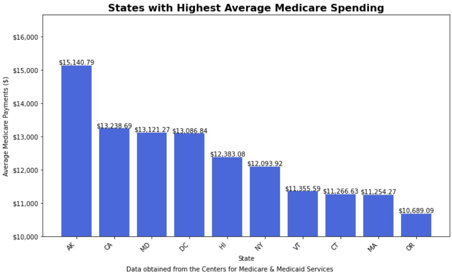

<!DOCTYPE html>
<html>
    <h1>Medicare Spending</h1>
    <section id='Introduction'>
    <h2>Introduction</h2>
        

    In this detailed exploration, Medicare spending data from 2011 to 2015 was examined to identify and analyze spending patterns across the United States. The dataset used in this study summarizes the utilization and payments for procedures, services, and prescription drugs provided to Medicare beneficiaries by specific inpatient and outpatient hospitals, physicians, and other suppliers. It includes data on common inpatient and outpatient services, all physician and other supplier procedures and services, and all Part D prescriptions. For more information: <a href="https://data.cms.gov/tools">click here</a>
    
By investigating the average Medicare payments made to providers in each state over these years, this analysis aims to uncover trends and variations in healthcare expenditures. The findings from this study provide valuable insights into how Medicare resources are allocated and highlight significant differences in spending across different regions of the country.

    </section>
    <section id='setup'>
        <h2>Installation and Setup</h2>
        
 
    The dataset for this analysis was obtained using Google BigQuery, a powerful and scalable data warehouse solution provided by Google Cloud. BigQuery enables users to run fast, SQL-like queries on large datasets, making it an ideal tool for handling extensive Medicare spending data. The benefits of using BigQuery include its ability to handle large-scale data analysis with high performance, its support for real-time data processing, and its ease of use for executing complex queries.
        

<!-- Gets data from 2011 to 2015 -->
    WITH combined_data AS 
    (SELECT provider_state, average_medicare_payments, 2011 AS year FROM `bigquery-public-data.cms_medicare.inpatient_charges_2011` UNION ALL 
    SELECT provider_state, average_medicare_payments, 2012 AS year FROM `bigquery-public-data.cms_medicare.inpatient_charges_2012` UNION ALL 
    SELECT provider_state, average_medicare_payments, 2013 AS year FROM `bigquery-public-data.cms_medicare.inpatient_charges_2013` UNION ALL 
    SELECT provider_state, average_medicare_payments, 2014 AS year FROM `bigquery-public-data.cms_medicare.inpatient_charges_2014` UNION ALL 
    SELECT provider_state, average_medicare_payments, 2015 AS year FROM `bigquery-public-data.cms_medicare.inpatient_charges_2015`) 
    SELECT provider_state, year, AVG(average_medicare_payments) AS avg_medicare_payments FROM combined_data GROUP BY provider_state, year ORDER BY provider_state, year;
</section>

<section id='Analysis'>
    <h2>Analysis</h2>

    To analyze spending patterns across states, choropleth maps were created using Python packages <strong>`pandas`</strong> and <strong>`plotly.express`</strong> to visually represent the average Medicare payments made to providers in each state from 2011 to 2015. The <strong>`pandas`</strong> library was utilized for data manipulation and aggregation, allowing for the efficient processing of the Medicare spending dataset. <strong>`plotly.express`</strong> was then employed to generate interactive choropleth maps that color-code each state based on their spending levels, allowing for a clear and intuitive comparison of Medicare expenditures across the country. By using these maps, it becomes easier to identify which states spend the most on Medicare and observe any patterns or similarities in spending. The visual representation helps to highlight regional trends and provides a comprehensive overview of how Medicare resources are distributed geographically, revealing significant insights into healthcare spending behavior across the United States.

    In addition to creating choropleth maps to analyze Medicare spending patterns across states, the analysis was supplemented with bar graphs to provide a more detailed comparison of average Medicare payments. Using the Python packages <b>`pandas`</b> and <b>`matplotlib`</b>, the data was processed to calculate the average Medicare payments per state across all years from 2011 to 2015. The top 10 states with the highest average spending and the bottom 10 states with the lowest average spending were identified. Bar graphs were then created to visualize these findings.

        
        

     States such as Alaska, California, Maryland, the District of Columbia, and Hawaii consistently exhibit the highest average Medicare spending across the years 2011 to 2015. Conversely, states like Alabama, Arizona, Mississippi, West Virginia, and Tennessee consistently demonstrate the lowest average Medicare spending during the same period. Identifying and understanding these regional disparities in Medicare spending are crucial for policymakers and healthcare professionals to optimize resource allocation and improve healthcare outcomes nationwide.

These observed disparities in Medicare expenditure across states reflect the complex factors influencing healthcare spending. While the Affordable Care Act essentially takes place at the state level, it can be noted that some states spend more than twice as much on health care as others, as a percent of state income. This can be attributed to the way private sector medicine is practiced across the different states. The public sector demonstrates much more variability from state to state than the private sector. In general, private sector spending is much more similar from state to state than government spending.

It should be noted that generalizing Medicare data may elicit defective conclusions. Different types of healthcare spending may substitute for each other, challenging the assumption that replicating healthcare practices from low-spending areas to high-spending regions would lead to substantial cost savings. For instance, states with higher uninsured rates may experience higher Medicare spending per enrollee due to increased unpaid bills, while simultaneously exhibiting lower private sector spending. Conversely, some states with high Medicare spending may demonstrate lower private sector spending and vice versa.

</section>

<section id='resources'>
    <h3>Resources</h3>
    <a href="https://www.healthaffairs.org/content/forefront/why-do-some-states-spend-more-health-care">HealthAffairs</a>
</section>
</html>

